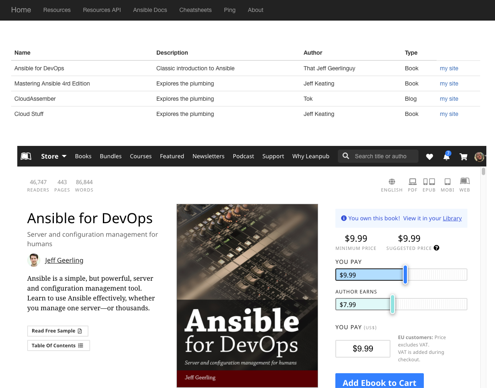

== Overview - `resource_hub`

A simple `flask` application offering a static, and dynamic, website and API originally
designed for use in Ansible Automation scenarios.

Tested with local `sqlite` and preferred `postgres` as backing store

.Screenshot with default data set

=== Setup

It is *strongly* recommended to run this in a Python virtual environment and a `requirements.txt` is supplied.
[source,bash]
----
python -m venv venv
source venv/bin/activate
pip install -r requirements.txt
----

=== Usage

.Preload sample dataset

A simple sample dataset is provided, Ansible related books and resources

* `resources.py` - Python dictionary defining resources
* `config.py` - Loads resources into database of choice

+
[source,bash]
----
python config.py
----

.Launch `resource_hub`

[source,bash]
----
export FLASK_APP=app
export FLASK_ENV=development    # Turn on debugging (not necessary when app.run(debug=True))

flask run
----

=== Testing the API

* Simple Ping
+
[source,bash]
----
curl <host>:<port>/api/v1/ping -s
----
+
[source,bash]
----
"{ ping: \"alive\" }"
----

* Call the `resources API`

+
[source,bash]
----
curl localhost:5000/api/v1/resources -s
----
+
[source,bash]
----
[
  {
    "author": "That Jeff Geerlinguy",
    "description": "Classic introduction to Ansible",
    "id": 1,
    "name": "Ansible for DevOps",
    "source": "Book",
    "url": "https://leanpub.com/ansible-for-devops"
  },
  {
    "author": "James Freeman, Jesse Keating",
    "description": "Explores how Ansible works",
----
